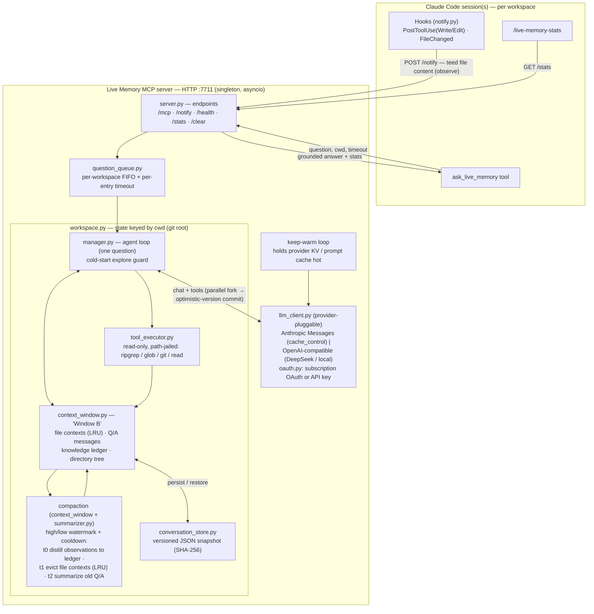

# Live Memory — Claude Code Plugin Design

**Live Memory** is a persistent, long-context, read-only codebase Q&A companion, packaged as a standalone **Claude Code plugin**. It is self-contained and depends on no other project.

## Motivation

The Live Memory is a cheap, large-context model that accumulates codebase knowledge across tasks and restarts, so other agents can ask it simple questions without re-loading the whole codebase. It is exposed as a single `ask_live_memory` tool.

We want this capability available inside **Claude Code** (Anthropic's CLI/SDK agent). Claude Code has a first-class **plugin system** (skills, subagents, hooks, MCP servers, monitors), so the design question is: *which plugin primitive can host a persistent, shared, KV-cache-preserving singleton that survives across sessions?*

## Decisions (locked)

1. **Primitive: an HTTP-transport MCP server inside a Claude Code plugin.** The only stateful, long-lived, queryable singleton (see below).
2. **Language: Python (asyncio).** A fresh implementation, not a port of any other codebase.
3. **Model: provider-pluggable, zero-config by default.** The Live Memory is an *independent* service with its **own** model config — it does not borrow the Claude Code session's model. The `ask_live_memory` *query* is the stable, provider-independent contract; the backend is swappable config supporting **two wire protocols** that cover ~every model:
   - **`anthropic`** — Anthropic Messages API (+ Bedrock/Vertex/gateways); explicit `cache_control` prompt caching.
   - **`openai`** — any OpenAI-compatible `/chat/completions` endpoint: OpenAI, **DeepSeek** (cheap + auto-caching — a great default), local models, gateways.

   **Zero-config:** with no API key but a Claude subscription present, it runs on the subscription **OAuth token + Haiku** automatically (the token is auto-refreshed; this draws on the subscription's *rate-limit* budget, not $-metered — a documented ToS gray area, opt-out-able). Switch models any time with the **`/live-memory-config`** slash command (writes `config.json`, hot-reloads the server) or env vars. KV-cache *control* is provider-specific (see §KV-cache).
4. **Compaction: batched neutral summarization, not front-truncation.** Front-pruning thrashes the prefix cache and discards accumulated knowledge; summarization retains compressed knowledge and amortizes the one-time cache invalidation. The summary is **query-neutral** (see §Compaction).
5. **State is per-workspace from day one.** One server, many clients/workspaces → window *and* queue are keyed by `cwd`. Not deferred to hardening.
6. **Lifecycle: an externally-supervised, idempotent singleton** (systemd/k8s/etc.), not a plugin-managed process. The HTTP transport requires a pre-running server; Claude Code does not start it (see §Lifecycle).
7. **Two-tier timeout.** `ask_live_memory` takes a **mandatory soft `timeout`** — the model is told its time budget and returns a best-effort answer at the deadline — set **below** the hard `.mcp.json` MCP timeout, so the graceful return always beats the client's hard-cancel.

## Feasibility

**Yes — via an MCP server packaged inside a Claude Code plugin, using HTTP transport.** Every functional requirement maps cleanly onto the plugin model: the manifest + `.mcp.json` + hooks replace any IDE-specific integration layer.

### Verified Claude Code mechanics (checked against current docs)

The design depends on these; all confirmed (note version floors):

- **`FileChanged` hook exists (v2.1+)** and fires on **out-of-band** file edits (not just tool-driven ones) — so external-edit awareness is real, not aspirational. Requires a `matcher`; debounce/batch the feed. The matcher can stay broad because the **server filters against its loaded-files set**: Live Memory tracks which files it has actually read, and a change to a file it has *never* read carries no stale context — so such events are dropped on a cheap set-membership check (only files currently in the context window can go stale).
- **`${CLAUDE_PLUGIN_DATA}`** is a real, **writable** per-plugin dir (`~/.claude/plugins/data/{id}/`) that survives plugin updates — the persistence target.
- **MCP per-tool-call `timeout` is configurable** in `.mcp.json` (default is very large) — the **hard** outer bound. On top of it, `ask_live_memory` takes a **mandatory soft `timeout` arg** (caller-supplied) the server enforces *below* the hard MCP timeout: the model is told its time budget, and at the soft deadline the server returns a graceful best-effort answer **before** the MCP client hard-cancels (which would lose everything). Set `.mcp.json` `timeout` = max-soft-timeout + margin; ensure the HTTP/SSE transport sends keepalives (60s first-byte budget).
- **A plugin-shipped `.mcp.json` may register `type:"http"`**, but **Claude Code does not start it** — the endpoint must already be listening, or the connection fails. This is why lifecycle is a decision, not an afterthought.

### Why the MCP server is the only viable primitive

Claude Code's plugin primitives are almost all **ephemeral per-invocation**:

| Primitive | Lifecycle | Owns persistent state? | Verdict for Live Memory |
|-----------|-----------|------------------------|--------------------------|
| **Skill** | Loaded into a turn's context | ❌ No | Wrong shape — it's a prompt, not a process |
| **Subagent** | Fresh context per spawn; transcript persists but context is re-summoned | ⚠️ Transcripts persist, but no shared *growing* window across spawns | Cannot hold one append-only window serving all callers |
| **Hook** | Fires on an event, runs a command/HTTP call, exits | ❌ No (state must live elsewhere) | Useful as a *feeder* (file-change notifications), not the brain |
| **Monitor** | Long-running background process emitting notifications | ⚠️ Has a process, but is one-way (notify Claude), not queryable | Wrong direction — can push, can't answer |
| **MCP server** | **Long-running process, many clients, owns arbitrary state** | ✅ **Yes** | ✅ **The only primitive that is a stateful, long-lived, queryable singleton** |

The Live Memory's defining traits — *persistent conversation that survives restarts*, *serialized FIFO queue*, *one growing window shared across all tasks* — require a **long-running process that owns state**. Only the MCP server fits.

### Transport choice is decisive for "shared across callers"

- **`stdio` transport** → Claude Code spawns a **fresh server process per session**. In-memory state is per-process; sharing requires external persistence + locking, and the FIFO queue would not serialize across sessions. Reject.
- **`http` / `sse` transport** → Claude Code **connects to one already-running server**. One process, many clients, one growing context window per workspace, one queue. **This is what we want.**

### Why not the Agent SDK

The Agent SDK (`@anthropic-ai/claude-code`) is a programmatic Claude Code *runner* (an agent-loop consumer), not an MCP-server framework. It cannot expose `ask_live_memory` to a running Claude Code session (that is the plugin/`.mcp.json`'s job), and it conflicts with the feature's two core requirements:

1. **KV-cache / compaction control** — The SDK *owns* the context window and runs its own auto-compaction (goal-biased, lossy). Live Memory needs the opposite: an append-only window with *its own* neutral, query-agnostic compaction. Using the SDK would mean disabling its compaction and hand-rebuilding the message array every call.
2. **Separate, cheap backend** — Live Memory runs a *cheap* model on whatever endpoint Claude Code's BYOM points at, selected independently of Claude's main-loop model and driven by our own loop. The SDK couples you to its model + loop.

**Reject the Agent SDK; use a raw provider client (Anthropic Messages or OpenAI-compatible) inside the MCP server.**

---

## Architecture

```
live-memory/
├── .claude-plugin/plugin.json      # manifest
├── .mcp.json                       # registers the MCP server (type:"http", explicit timeout)
├── hooks/                          # PostToolUse(Write|Edit) + FileChanged → notify the server
│   ├── hooks.json
│   └── notify.py
├── skills/live-memory/SKILL.md     # tells Claude when/why to call ask_live_memory
├── commands/                       # USER-facing slash command (the agent never sees it)
│   ├── live-memory-stats.md        # /live-memory-stats → GET /stats
│   └── stats.py
├── settings.json
└── server/live_memory/             # the long-running MCP server (Python, asyncio)
    ├── server.py                   # MCP (HTTP) server + /health + /stats + /notify
    ├── workspace.py                # per-cwd state registry (window + queue + store)
    ├── manager.py                  # the agent loop (process one question)
    ├── context_window.py           # token budget; file-context evict, Q&A summarize
    ├── summarizer.py               # NEUTRAL, query-agnostic knowledge-ledger summarization
    ├── question_queue.py           # per-workspace FIFO + per-entry timeout (asyncio)
    ├── conversation_store.py       # versioned JSON snapshot (SHA-256 file validation)
    ├── llm_client.py               # provider-pluggable: Anthropic Messages (cache_control) | OpenAI-compatible
    ├── oauth.py                     # subscription OAuth credential + auto-refresh (zero-config default)
    ├── tool_executor.py            # read-only tools (ripgrep/glob/git/read), path-jailed to cwd
    ├── directory_tree.py           # workspace scan, ~10% context cap
    ├── prompts.py                  # system prompt + neutral-summary prompt
    ├── pricing.py                  # per-model USD cost
    ├── models.py / config.py
```

> **Python note:** Anthropic has **no local tokenizer**. The `context_window` budget math uses a `chars/≈4` heuristic, reconciled against the real `usage` returned per response. (A `count_tokens` round-trip is an alternative for exactness at the cost of latency.)

### Component & data-flow diagram



**Reading it:** file I/O in a session is teed to `/notify` and folded into Window B (`observe`) — passive
learning. A question flows `/mcp → queue → manager`; the manager answers from Window B, calling the
read-only path-jailed tools only for what the window hasn't seen, against the server's own cheap model.
Compaction keeps the window bounded (distill → evict → summarize) under a high/low watermark; the window
is snapshotted to disk so memory survives restarts; a keep-warm loop keeps the provider cache hot.

### Two-context-window model (the key insight)

There are **two distinct context windows**, and the Live Memory only needs control over one:

| Context window | Owner | Compaction | Does Live Memory care? |
|----------------|-------|------------|------------------------|
| **A. Claude Code's main conversation** (user ↔ Claude) | Claude Code | Claude Code's auto-compaction (goal-biased) | **No.** Only the `ask_live_memory` *answer string* lands here. |
| **B. The Live Memory's own conversation** (cheap model ↔ itself) | **The MCP server** | **Us** | **Yes — append-only, with our own neutral summarization.** |

Because Window B lives entirely inside the MCP server (which makes its own raw API calls), **Claude Code's compaction never touches it** — Claude Code has no idea it exists. This is also why the **neutral-summary requirement is achievable**: the server fully owns Window B's compaction prompt and model, so it can summarize query-agnostically — something a normal Claude Code session cannot control.

### KV-cache preservation (provider-specific control)

The server builds the raw request, so it can satisfy the cache-warming **preconditions** (stable prefix, append-only between compactions, volatile-trailing-turn) regardless of provider. How the cache is *realized* is provider-specific: the **`anthropic`** adapter expresses explicit `cache_control` breakpoints; the **`openai`** adapter relies on the provider's implicit prefix caching (DeepSeek/OpenAI cache automatically). Whether explicit breakpoints are honored depends on the endpoint:

| Endpoint behind Claude Code's BYOM | `cache_control` honored? |
|---|---|
| Anthropic API / Bedrock / Vertex (Claude) | ✅ Yes — explicit breakpoints work |
| A translating gateway to a non-Claude model (Gemini/GPT/…) | ⚠️ Maybe — gateway maps it to that provider's implicit, TTL-bound prefix caching, or ignores it |
| A backend with no caching | Harmless no-op |

The **invariants are mandatory regardless of provider** (they're the preconditions for *any* caching):

1. **Stable prefix** — system prompt + directory tree never mutate between questions.
2. **Append-only between compactions** — files modified by tasks are *not* evicted; a "recently modified" note is attached to the next question's trailing turn instead.
3. **Volatile hints on the trailing turn only** — per-question content never enters the prefix.

**Keep-warm (opt-in, `LIVE_MEMORY_KEEP_WARM`, default off).** Caches expire after an idle TTL; once cold, the next query re-reads the whole prefix at full rate. A background loop (`keep_warm.py`, started lazily on the first query) periodically issues a **minimal** request — the same system + history prefix, `max_tokens=1`, output discarded — against each recently-active workspace, re-reading the cached prefix and refreshing its TTL. The interval is **provider knowledge** (`_keep_warm_default`): Anthropic/OpenAI ~240s (minute-scale TTLs); **DeepSeek auto-set to ~6h** because its on-disk cache lasts hours/days — longer than `keep_warm_max_idle` (default 30 min), so the loop never fires for it (the cache outlives the session anyway). Overridable per deployment (`LIVE_MEMORY_KEEP_WARM_INTERVAL_S`), like `base_url`/`model`. Eligibility: non-empty window, not mid-query, queried this process within `max_idle`, and last touched ≥ interval ago.

Prefix layout (Anthropic breakpoints shown; other endpoints rely on identical-prefix matching):

```
[ system prompt + directory tree ]            ← breakpoint 1 (most stable; survives compaction)
[ neutral knowledge summary ]                 ← breakpoint 2 (changes only on a compaction event)
[ file-context manifest (current) ]
[ live Q&A pairs since last compaction ]      ← breakpoint 3 (append-only between compactions)
[ recently-modified hint + current question ] ← volatile, never cached
```

### Compaction: batched neutral summarization (not truncation)

When Window B fills, **front-truncation is the worst case** — dropping the oldest items shifts every later token and invalidates the prefix cache from the prune point, and (worse) discards accumulated knowledge a *shared* KB queried for unrelated things still needs. So:

- **Compact rarely, in large batches, via summarization.** Summarization also invalidates from the summary point — but as a batch op it amortizes that single invalidation over many subsequent append-only, cache-hit questions. (On Anthropic, breakpoint 2 re-warms after each compaction; breakpoint 1 survives.)
- **Hysteresis is what makes "rarely" true.** Compaction uses a **high/low watermark**: it TRIGGERS once fill exceeds `compaction_threshold` (0.85) but then compacts all the way down to `compaction_floor` (0.6, configurable) — *not* back to the trigger. Compacting to the trigger is a trap: the next observation/answer immediately re-crosses it, so the window is re-compacted (and its prefix cache busted) **every question** — measured at ~10× cost under passive-ingestion overflow. The floor leaves headroom so the next *several* questions run against a stable, cache-hit window. (Floor == threshold reproduces the thrash.)
- **Three tiers of evictable content, handled differently (in order):**
  - **Observed file content** (passive ingestion — teed bytes held inline, see §Data Flow 3c) is the bulk of any bloat → **distill the LRU observations into the neutral knowledge ledger (one batched call) + drop the raw bytes**, leaving a manifest-only entry that stays re-readable. The retention knob: raw while it fits (no re-read), summarized into the lean prefix under pressure. **Distillation is rate-limited** by a per-workspace cooldown (`distill_min_interval_s`, default 60s): when the window is over budget again *within* the cooldown — or a concurrent fork is already distilling — this tier instead **sheds the raw bytes for free** (drop content, keep the manifest) rather than summarizing again. Because observations are re-derivable from the agents' ongoing I/O, this bounds summarizer cost under heavy multi-session teeing with no durable-knowledge loss (it's re-learned, or already in the ledger). The reservation timestamp is taken *before* the summarizer await, so racing forks shed instead of launching duplicate distillations.
  - **File contexts** (manifest-only) are *re-readable from disk* (the file is the source of truth) → **evict (LRU) + lazy-reload** on next reference. No knowledge lost.
  - **Q&A history** is the irreplaceable accumulated reasoning → **summarize into the neutral knowledge ledger** (breakpoint 2). Never hard-dropped.
- **The summary must be query-neutral.** Normal compaction summarizes *toward the current goal*; that's exactly wrong here — a goal-biased summary compresses away knowledge irrelevant to recent queries but vital to future, unrelated ones. Therefore the summarizer:
  - uses a **dedicated, fixed, query-agnostic prompt** that distills *durable codebase facts* (structure, locations, component relationships, conventions — "X does Y, lives in Z"), not "the answers to the last few questions";
  - runs with **recent/current queries out of scope** (fed only the evicted history), so it structurally cannot bias toward them;
  - emits a **structured knowledge ledger** (facts/locations/relationships), denser and more stable as a cache prefix and easy to extend on the next compaction;
  - may use a **cheaper model** than the query path (the server owns this call).

- **Window size is config-driven** — the budget + compaction thresholds read the configured model's context size, not a hardcoded constant.

### Status / stats (end-user surface, **not** an agent tool)

A status/stats surface is provided — but as a **human-facing** surface, deliberately **not** an MCP tool. The agent only needs `ask_live_memory`; exposing internal stats to the model would waste its tool budget and tempt needless calls. **Audience split:** agent → the `ask_live_memory` tool; human → the surfaces below.

- **`/stats` endpoint** (read-only, per-`cwd`) on the server: context-window fill (used/total tokens, %), # Q&A messages retained, # file contexts loaded (+ stale count), last compaction + summaries written, # questions answered, cumulative cost (USD), queue depth / in-flight, uptime, and the active model/endpoint.
- **`/live-memory-stats` slash command** — the primary on-demand entry point; GETs `/stats` for the current workspace and prints a formatted summary. **Never enters the model's context.**
- **(optional) statusline segment** — ambient at-a-glance (fill % + cumulative cost).

---

## Data Flow

### 1. Plugin load

```
Claude Code starts → loads plugin → reads .mcp.json (type:http, timeout set) → connects to http://<host>:<port>/mcp
  → server already running (externally supervised singleton), state restored from per-workspace disk snapshot
  → ask_live_memory tool becomes available to Claude
```

### 2. Question (synchronous, blocking)

```
Claude calls ask_live_memory(question, cwd, timeout)   (mandatory soft timeout; blocks until answer or that deadline)
  → server selects the per-workspace state keyed by cwd
  → admits into the workspace (serial: one at a time; parallel: up to max_parallel) with `timeout` as the entry deadline
  → on admission (parallel: against a fork of the window; serial: the live window):
      → drain recentlyModifiedFiles set → build trailing-turn hint (incl. the model's remaining time budget)
      → if over the SOFT threshold (compaction_threshold, default 85% of max) → COMPACT down to it:
        evict re-readable file contexts (LRU) first; if still over, neutrally summarize oldest Q&A
        history into the knowledge ledger (separate cheap call, recent queries out of scope)
      → build stable prefix (system prompt + directory tree + knowledge ledger + file-context manifest)
      → agent loop (max 25 iterations, bounded by the soft deadline):
          → llm_client.chat(system, messages, tools, cache_control)   ← raw call; server controls the array
          → if no tool calls → final answer, break — UNLESS the memory is COLD (no observed file
            content in-window + ~empty ledger): reject that answer once and force one Grep/Read pass,
            so a cold cheap model grounds instead of confabulating exact values (warm memory is
            unaffected; toggle via `force_explore_when_cold`)
          → execute read-only tool calls (path-jailed), append results
          → enforce budget (evict file contexts; preserve in-flight tool turns)
      → on soft-deadline: stop the loop, take the best-effort answer so far (return BEFORE the hard MCP timeout)
      → append user Q + assistant A to the window (append-only)
      → COMMIT the window back (serial: in place; parallel: replace the committed window iff this
        fork explored more — longest/most-exploring wins); count the question + account its cost
      → persist snapshot to disk
      → return QuestionResult { answer, tokensUsed, contextUsage, costSnapshot, timedOut?, toolCalls, filesRead }
```

### 3. File-change awareness (two complementary mechanisms)

**a. External edits / deletes** — `FileChanged` hook (v2.1+, debounced) → HTTP POST to server → **filter: if `path` is in the loaded-files set** (else drop). `FileChanged` carries the change type (`change`/`add`/`unlink`), forwarded by `notify.py`, and the server branches on it:
  - `change`/`add` → `invalidate_file_context` (marks **stale**, retains slot; lazy re-read on next reference) → manifest: *"CHANGED since you read it."*
  - `unlink` → `mark_file_deleted` (a **distinct** state — there's nothing to re-read here) → manifest: *"DELETED or moved/renamed; it no longer exists at this path"*, telling the agent to relocate it (Glob/Grep/find_paths) or report it gone. A move/rename surfaces as `unlink`(old)+`add`(new); the old path is reported gone (the hook gives no old→new correlation). On reload, missing files are dropped by SHA-256 validation regardless.
  A server-side OS watcher is the fallback if `FileChanged` is unavailable.

**b. Task/tool edits** — `PostToolUse` hook (matcher `Write|Edit`) → HTTP POST → **filter: if `path` is in the loaded-files set**, add to `recentlyModifiedFiles` (else drop — a file Live Memory never read has no prior knowledge to be stale). **No eviction** (append-only preserved); the set is drained into the next question's trailing-turn hint. *(Superseded by passive ingestion (c) when enabled: teeing the new bytes is strictly stronger than a stale hint.)*

**c. Passive (organic) population** — `PostToolUse` hooks (matchers `Read` and `Write|Edit|MultiEdit|NotebookEdit`) → `notify.py` reads the file's **current bytes locally** (free — no model tokens; the cost the design avoids is the *premium* re-read) and POSTs `{paths, contents}` to `/notify`. With `passive_ingestion` on (default), the server `observe()`s each: upsert a **content-bearing** file context (fresh hash, bytes held inline), rendered into the volatile system block so the model answers **without re-reading**. Unlike (a)/(b) this records **even for never-read files** (it *is* the new knowledge) and marks the file **current** (not stale). A `FileChanged` echo of our own teed edit is ignored within a short grace window. Bytes are **in-memory only** (never persisted — snapshots stay lean and re-warm from real work) and are distilled into the ledger by compaction tier 0. This directly removes the cheap-side exploration/warm-up cost (FUTURE_DIRECTIONS §1); floor = today's behavior (active fallback) when off or when content is absent. Per-file size cap (`passive_max_file_bytes`, default 256 KiB) at both hook and server.

Mechanisms (a)/(b) are scoped to **files Live Memory has actually read** (that read set grows as it answers more questions); (c) also *grows* that set from the agent's own I/O.

**Many sessions, one feed.** Every Claude Code session runs its own hooks, all POSTing to the single server. `/notify` mutates in-memory state **synchronously on one event loop** (no `await` between read and write), so parallel sessions' edits/deletes accumulate **race-free** with no locking; `recentlyModifiedFiles` is a set (dedupes), and **same-repo sessions share ONE workspace** (canonical cwd) so all their changes pool into that shared memory (the intended unified view; different repos → independent workspaces). What accumulates is change *awareness* (stale/deleted flags + trailing-turn hints), not file content (re-read on demand). Soft edges, all best-effort and reconciled rather than guaranteed-live: `/notify` only applies to an **already-loaded** workspace (queried ≥ once — it doesn't lazy-load); under parallel queries a pending hint may be drained by one in-flight fork (a timeliness gap, not a correctness one — notifications arriving mid-query land on the committed window and are seen by the next query); and if the server is **down** the POST is lost, then reconciled by **SHA-256 re-validation on the next load** (changed/deleted read files are dropped). So the failure mode is *under-awareness* (quietly re-read later), never *false* stale knowledge.

> Hooks are the file-change feed — the Claude Code equivalent of an editor's file-save event plus a filesystem watcher.

---

## Server components

| Module | Responsibility |
|--------|----------------|
| `server.py` | MCP (HTTP) server exposing `ask_live_memory` (+ optional `ask_live_memory_submit`/`_result`); plus `/health`, `/stats`, `/notify`, `/reload`, `/clear` routes; lazily starts the keep-warm loop. Idempotent singleton. |
| `workspace.py` | Per-`cwd` state registry: each workspace owns its own window, queue, and store. |
| `manager.py` | The agent loop — process one question against Window B (the 25-iteration tool loop, deadline-bounded). |
| `context_window.py` | Token budget; file-context LRU eviction (sync) + delegated Q&A summarization. |
| `summarizer.py` | **Neutral, query-agnostic** knowledge-ledger summarization (own prompt + cheap model). |
| `question_queue.py` | Per-workspace admission `Semaphore(max_parallel)` (1 = serial FIFO, N = parallel); soft-deadline self-limit + hard `wait_for` backstop; bounded size. |
| `async_jobs.py` | Opt-in fire-and-forget job registry (`JobRunner`) backing `ask_live_memory_submit`/`_result` — runs a question in a background task, one-shot collect, TTL sweep. |
| `keep_warm.py` | Background loop that pings each recently-active workspace's prefix (`max_tokens=1`) to keep the provider's KV/prompt cache warm; provider-aware interval. |
| `conversation_store.py` | Versioned JSON snapshot under `${CLAUDE_PLUGIN_DATA}/<workspace-hash>.json`; SHA-256 file validation on load. |
| `llm_client.py` | **Provider-pluggable**: `AnthropicClient` (Messages API, `cache_control`, API-key *or* subscription OAuth) and `OpenAIClient` (any OpenAI-compatible `/chat/completions` — DeepSeek/OpenAI/gateways). `make_client()` factory. |
| `oauth.py` | Claude subscription OAuth credential + **auto-refresh** (the zero-config, no-key default). Persists refreshed tokens to the plugin's own data dir. |
| `config.py` | Layered config: **env > `config.json` > defaults**; provider knowledge (base_url/model/keep-warm interval); auto-OAuth detection; cwd canonicalization; `/reload` hot-swaps the model/provider. Sources every numeric default from `constants.py`. |
| `constants.py` | **Central registry of all tunable magic numbers + defaults** — every internal knob and every default value in one reviewable/editable file; no magic numbers scattered across modules (user config still flows through env/`config.json`, whose defaults live here). |
| `models.py` | Core dataclasses (`ChatMessage`, `FileContext`, `CostSnapshot`, `QuestionResult`, …) + `estimate_tokens`. |
| `tool_executor.py` | Read-only tools — `Read`, `Grep`, `Glob` (Claude Code-native names/schemas) plus three bespoke explorers that stand in for `Bash` (`find_paths` ≈ `find`, `get_changed_files` ≈ `git status`, `git_search` ≈ `git log`) — all **path-jailed to `cwd`**. No `Bash`/`Write`/`Edit`: Live Memory only explores, never executes or mutates. |
| `directory_tree.py` | Workspace scan for the stable prefix, ~10% context-window cap. |
| `prompts.py` | System prompt + the neutral-summary prompt. |
| `pricing.py` | Per-model USD cost from token usage (substring rate table; `LIVE_MEMORY_PRICE_*` env overrides win). |
| `logging_setup.py` | Configures logging: stderr → journald, plus an optional rotating file (`LIVE_MEMORY_LOG_FILE`). |

- The `ask_live_memory` MCP tool is the uniform, provider-independent **query** contract; args `question`, `cwd`, mandatory soft `timeout`.
- **`cwd` must be an absolute path; it is the workspace partition key.** A shared `type:http` server cannot auto-derive the caller's directory (verified: no MCP `roots` for http, no per-request session→cwd, hooks can't be correlated, `${CLAUDE_PROJECT_DIR}` is config-time only) — and a *relative* cwd cannot be resolved correctly (it would anchor to the *server's* dir), so relative paths are **rejected** rather than mis-resolved. The tool description + skill prescribe "pass your absolute repo root." Server-side, each cwd is **canonicalized to its enclosing git repo root** (`canonical_workspace`, default on, `LIVE_MEMORY_CANONICALIZE_WORKSPACE`), so a subdirectory and the repo root collapse to one workspace — no accidental per-subdir memory fragmentation. A `.git` **file** (git worktrees/submodules) counts as a repo root, matching `git rev-parse --show-toplevel`. For a path inside a **submodule**, `LIVE_MEMORY_REPO_ROOT_MODE` selects `nearest` (default — the submodule is its own repo/workspace, jailed to itself) or `outermost` (fold it into the **superproject** root, one shared memory that can also read the parent's files).
- **Every answer carries a compact metadata trailer** (`---\n[live-memory] model=… latency=… tokens=…(in/out) tool_calls=… files_read=… cost=… context=…`) so the calling agent sees per-question accounting (the tool result is otherwise just the answer text). `cost` is `n/a(subscription)` when not metered.
- **Same-workspace concurrency is configurable** (`LIVE_MEMORY_CONCURRENCY`, default `parallel`):
  - **`parallel`** (default) — no queue delay: each question **forks** the current window (an independent clone, tagged with the current window **version**) and up to `LIVE_MEMORY_MAX_PARALLEL_QUERIES` run at once. Commit uses **optimistic concurrency**: a **linear** update (no other question committed since this fork was taken) is **always adopted** — so a net-*shrinking* change, i.e. a **compaction**, is never discarded; only on a genuine **race** (a concurrent fork already committed) does the tiebreak keep the fork that **explored more** (`exploration_score` = #files-read, then tokens). Every caller still gets its own answer; a losing raced fork's Q&A is dropped from shared memory. Forking + a brief commit lock make it race-free without serializing the LLM work. *(Earlier "most-exploring always wins" wrongly discarded compaction — a compacted fork is smaller — so the version check was added; see the linear-commit regression test.)*
  - **`serial`** — one question at a time per workspace (`Semaphore(1)`); the shared window grows in place. Strong KV-cache locality; concurrent same-workspace callers wait.
  - *(Questions to **different** workspaces always run fully concurrently regardless of this flag — state is per-`cwd`; the flag governs only same-workspace admission.)*
- **Async tools are opt-in** (`LIVE_MEMORY_ASYNC_TOOLS`, default off). MCP has no native async/background tool calls (verified), so when enabled the server adds the submit/poll pair `ask_live_memory_submit` → `job_id` (runs in a background task via the same queue) and `ask_live_memory_result(job_id)` → answer or `[running]`. The agent drives the polling; jobs are one-shot-collected with a TTL sweep (`async_jobs.JobRunner`).
- Status is **human-facing** (`/stats` endpoint + `/live-memory-stats` slash command + optional statusline) and never an agent tool.
- Config comes from env vars / plugin `settings.json` / `${user_config.*}`.

### Tool schema design

The exploration tools the **sub-model** calls (distinct from the `ask_live_memory` MCP tool that other agents call) are defined to two different standards — they are not the same thing:

**1. Definition format — native Anthropic, exactly.** Every entry in `TOOL_SCHEMAS` uses the Anthropic Messages API shape — `{"name", "description", "input_schema": <JSON Schema>}` (note `input_schema`, not OpenAI's `{"function": {"parameters": …}}`). The `AnthropicClient` passes them through verbatim; the `OpenAIClient` translates them to OpenAI's function-tool shape at request time (`_tools_to_openai`). So provider-independence is preserved while the canonical definition stays Anthropic-native.

**2. Fidelity to Claude Code's *built-in* Read/Grep/Glob — approximate, by design.** We match the **names and the core/common parameters** so a Claude-Code-trained model uses them naturally, but we deliberately do **not** clone the full official schemas. Known divergences (all intentional):

| Tool | Matches native | Diverges (and why) |
|---|---|---|
| `Read` | `file_path`, `offset`, `limit` | path is **workspace-relative** (the path-jail), not absolute; **text-only**, not multimodal (read-only explorer has no need for images/PDF/notebooks). |
| `Grep` | `pattern`, `path`, `glob`, `output_mode` (`content`/`files_with_matches`/`count`), `-i`, `head_limit` | omits `-n`/`-A`/`-B`/`-C`/`type`/`multiline`; defaults **case-insensitive** (friendlier for exploration; native defaults case-sensitive). |
| `Glob` | `pattern`, `path` | adds a non-native `limit` (output bound). |

Handlers also accept the **legacy arg aliases** (`path`, `regex`, `file_pattern`, `max_results`) for compatibility.

**The bespoke explorers** (`find_paths`, `get_changed_files`, `git_search`) have no native *tool*; their native equivalent is a `Bash` command (`find` / `git status` / `git log`), which Live Memory deliberately does not ship. They are curated, not exhaustive: the toolset was deliberately kept lean — a cheap model does better with a small, orthogonal set than with many near-duplicates — and chosen to give a *memory* agent the **temporal and structural** knowledge that `Read`/`Grep`/`Glob` cannot:

- `git_search` — commit history (the "why"): message grep + path-scoped log + optional `-p` diffs. The single highest-leverage tool for a persistent memory, since rationale and change history live nowhere in the current tree.
- `get_changed_files` — live working-tree state (`git status`); pairs with the file-change notification feed.
- `find_paths` — `find`-style tree enumeration (name/type/depth), the niche `Glob` (pure file-glob) doesn't cover: listing directories, bounded-depth walks.

Earlier redundant explorers were **pruned**: `list_files` (⊂ `Glob`/`find_paths`), `read_project_structure` (the directory tree is already injected into the system prompt), and `get_project_setup_info` (stack is visible in that tree and distilled into the ledger after first contact).

This is "close enough that a Claude-Code-trained model is at home," **not** a byte-exact clone. Exact drop-in parity (full native schemas: `-n`/`-A`/`-B`/`-C`/`type`, case-sensitive default, no `Glob` `limit`) remains an option if a future need calls for it.

---

## Scope: In / Out

### Out (deliberately not in a plugin)
- **Webview chat panel + live token streaming** — plugins have no webview. (Status is **not** dropped — it moves to `/stats` + the slash command; see §Status/stats.)
- **Any IDE/editor host integration** (settings API, webview message bus, in-editor tool-filter plumbing) — replaced by the plugin manifest + `.mcp.json` + hooks.

### In (the core value)
- Persistent conversation history across sessions (server-side disk snapshot).
- Per-workspace question admission — **serial** FIFO (default) or **parallel fork-join** (`LIVE_MEMORY_CONCURRENCY`).
- Append-only, KV-cache-preserving window **between compactions**; batched **neutral summarization** on compaction.
- Cheap, large-context model via Claude Code's BYOM endpoint; uniform `query` interface.
- Read-only tool restriction (server exposes only read tools, path-jailed to `cwd`).
- File-change awareness (via hooks, with a server-side watcher fallback).
- Cost tracking + context-fill reporting (returned in `QuestionResult` and via `/stats`).

---

## Implementation Phases

### Phase 1 — Minimal MCP server + one tool + workspace keying + lifecycle
HTTP MCP server exposing `ask_live_memory`, a provider-pluggable client (Anthropic Messages or OpenAI-compatible; **zero-config subscription OAuth + Haiku** when no key is set), an in-memory **per-`cwd`** context window, and disk persistence. Run as an **idempotent singleton** with a `/health` endpoint. Testable via a local `.mcp.json` (explicit `timeout`).

### Phase 2 — Plugin packaging + hooks
Wrap in the plugin structure (`.claude-plugin/plugin.json`, `.claude-plugin/marketplace.json` — the dir doubles as a single-plugin marketplace, `source: "./"`, so `/plugin install live-memory@shofer` works; `.mcp.json`, `hooks/hooks.json`). Wire `PostToolUse(Write|Edit)` and `FileChanged` (debounced) to feed the server. Add `skills/live-memory/SKILL.md` and the `/live-memory-stats` command.

### Phase 3 — Per-workspace queue + KV-cache breakpoints + neutral compaction + directory tree
Per-workspace FIFO, the recently-modified-files set with trailing-turn hint placement, the neutral summarizer + the file-context-evict / Q&A-summarize split, the breakpoint layout, and directory-tree injection into the stable prefix.

### Phase 4 — Cost + config-driven window
Per-model USD cost; make window size + compaction thresholds read the configured model's context size.

### Phase 5 — Hardening
Graceful shutdown + snapshot flush; abort propagation through queue and LLM call; the OS-watcher fallback; path-jail tests for the read tools; telemetry/error logging.

---

## Open Questions

1. **Server hosting** — systemd service vs container sidecar vs other supervisor. Either works; the requirement is an **externally-supervised, always-on, idempotent singleton** (HTTP transport needs it pre-running; Claude Code will not start it, and a `SessionStart`-lazy-launch races the MCP connection). A `SessionStart` health-check-and-wait is acceptable only as a backstop. **Env wrinkle:** since the server is a separate process (not spawned by Claude Code), the supervisor must hand it the **same provider env Claude Code uses** (`ANTHROPIC_BASE_URL` / auth, or Bedrock/Vertex) so both hit the same backend.
2. **Semantic search** — optionally add a `rag_search` tool backed by an embeddings index, or stay limited to ripgrep/glob/git. (Omitted in the initial build — no host dependency.)
3. **Summary model** — use the same BYOM model for the neutral summary, or a separately-configured cheaper one? (The server owns this call, so either is trivial.)
4. **Token counting** — `count_tokens` round-trip (accurate, adds latency) vs `chars/≈4` heuristic reconciled against `usage` (cheap, approximate — the chosen default). **Decided — see [Appendix A](#appendix-a--token-counting-decision).**

---

## References

- Claude Code plugins: https://docs.claude.com/en/docs/claude-code/plugins
- Claude Code hooks (`PostToolUse`, `FileChanged`): https://docs.claude.com/en/docs/claude-code/hooks
- Claude Code MCP: https://docs.claude.com/en/docs/claude-code/mcp
- Claude Code subagents (rejected for this use): https://docs.claude.com/en/docs/claude-code/sub-agents

---

## Appendix A — Token counting (decision)

**Decision: keep the `chars/≈4` heuristic (`models.estimate_tokens`, `CHARS_PER_TOKEN=4`) as the
budget unit; do NOT add a `count_tokens` round-trip.** Anthropic ships no local tokenizer, so the
window budget (compaction trigger/floor, LRU eviction, directory-tree cap, `/stats` fill%) is
estimated from character length and treated as **soft** — being off by ±10–15% only makes compaction
fire slightly early/late; it is never a correctness input.

**Why not `count_tokens` (exact, server-side):**
- **Impedance mismatch.** `count_tokens` returns one integer for a *whole request*; the budget code
  needs *per-item* sizes to choose what to evict. Exact per-item counting = N round-trips.
- **Latency.** ~100–300 ms per call on the question hot path (once per question at least; more if
  per-item), for a bound that's already soft.
- **Provider asymmetry.** Only the `anthropic` provider has the endpoint; OpenAI-compatible
  (DeepSeek, local, gateways) would still fall back to a heuristic/`tiktoken` (itself approximate for
  non-OpenAI tokenizers). Exactness would be Anthropic-only.
- **Availability.** `count_tokens` has its own rate limit and it's unverified whether the subscription
  OAuth token authorizes it — so it could never be a hard dependency anyway.

**What we rely on instead:** every `chat()` response already returns `usage.input_tokens` — the exact
size of what was just sent — so the heuristic is *reconciled against ground truth for free* after each
call. The one case exactness truly prevents (overflowing the model's **hard** context limit) is best
handled **reactively**: catch the "prompt too long" error, compact, retry — cheaper than proactively
counting every query.

**If more precision is ever wanted (higher-ROI than `count_tokens`):** self-calibrate
`CHARS_PER_TOKEN` per workspace/model from observed `usage` (e.g. an EMA of actual÷estimated) — turns
the ±15% heuristic into ±few-% with zero added latency and no provider asymmetry. Reserve an actual
`count_tokens` call, if ever, for a *single* boundary check only when the heuristic says we're within
~10–15% of the hard limit.

---

## Appendix B — The knowledge ledger (format & lifecycle)

The **knowledge ledger** is Live Memory's durable, distilled memory of a repo: a single free-text
block per workspace (`ContextWindow.knowledge_ledger: str`), persisted in the snapshot and rendered
near the top of the **volatile** system block on every question, under `## Accumulated knowledge
(durable facts distilled from earlier questions)` (empty until the first compaction —
`prompts.empty_ledger_text()`).

**Format — a convention, not a schema.** There is no rigid grammar; the shape is *guided by the
summary prompt* (`prompts.NEUTRAL_SUMMARY_SYSTEM_PROMPT`), deliberately kept as **dense natural
language** rather than JSON/graph so the model still reasons well over it (the density "sweet spot" —
too terse/symbolic and the LLM reasons *worse*; see FUTURE_DIRECTIONS §2). The convention the prompt
enforces:

- **Dense, structured facts** — *locations* (where things live), *relationships* (what calls /
  consumes / depends on what), and *conventions*. Canonical example (from the prompt):
  `Auth lives in src/auth/*; SessionManager (src/auth/session.ts) issues tokens; consumed by api/middleware.ts`.
- **Query-agnostic** — general, reusable codebase facts, NOT "the answer to the last question"; the
  summarizer runs with recent/current queries *out of scope* so it cannot bias toward them.
- **Merged & de-duplicated** — each compaction *extends* the existing ledger; facts already present
  are not repeated; conversational filler, tool-call mechanics, and one-off specifics are dropped.
- **Grounded** — never invents facts; records only what the transcript/ledger support.

**Lifecycle.**
1. Starts empty.
2. **Grown by compaction** (`manager._maybe_compact`): tier-0 folds evicted *observed file content*
   into it, and tier-2 folds the oldest *Q&A pairs* into it — both via
   `summarizer.summarize(existing_ledger, dropped)`, which calls the neutral summarizer and returns
   the **updated ledger text only** (a merge of existing + newly-dropped; input capped at
   `MAX_TRANSCRIPT_CHARS` per call). Distillation into the ledger is rate-limited by the per-workspace
   cooldown (see §Compaction).
3. **Rendered** into the volatile system block each question — kept *out* of the cached stable prefix
   so it can grow without busting the directory-tree cache — and consulted "context-first" before any
   tool call.
4. **Persisted** verbatim in the per-workspace snapshot; reloaded on restart.

**Why free text, not a parseable schema.** It is read by an LLM, not a parser; the goal is *the right
facts at a density the model reasons over cheaply*, plus a stable, extend-only prefix that stays
cache-friendly. A denser, graph/skeleton representation is a parked future direction
(FUTURE_DIRECTIONS §2), not the current contract.

---

## Appendix C — Behaviour on very large codebases (scaling limits)

**Verdict: accumulation cannot overflow the context window; the limits are knowledge *loss* and
one per-question hard-error edge — not unbounded growth.**

**Why accumulation can't overflow.** Compaction (`_maybe_compact`) can always shed the persistent
window down to a tiny floor: observations shed to manifest one-liners (tier 0), manifest file
contexts evict LRU (tier 1), Q&A summarizes to ~2 messages (tier 2). Crucially the **ledger
self-caps**: each compaction regenerates it via `summarizer.summarize` → `llm.complete(...,
max_tokens=2048)`, so it is bounded to ~2048 tokens regardless of how much the repo "taught" it.
The tracked budget (`estimated_token_count` = messages + file-contexts + ledger) can therefore
always be driven under `compaction_floor`. The persistent window is structurally bounded to roughly
*(dir-tree ≤10%) + (ledger ≤2k) + minimal Q&A*.

**The real limits as the repo grows very large:**

1. **Ledger saturation → knowledge loss (fundamental).** The ~2048-token ledger is far too small to
   represent a huge repo. As the known surface grows, each compaction crams an ever-larger fact set
   into 2048 tokens, so the summarizer **squeezes out older/less-recent facts** (or truncates) — a
   lossy, recency/frequency-biased summary. Live Memory degrades (lower recall, more re-exploration),
   it does not crash. A flat single-ledger store inherently can't hold a large repo → the fix is
   retrieval, not a bigger ledger (FUTURE_DIRECTIONS §2 and §4).
2. **Directory-tree scan is O(all files).** `directory_tree._scan` walks the whole workspace and
   builds the full structure in memory before rendering + truncating to ~10% of the window. Output is
   bounded (no overflow), but the **scan is slow/memory-heavy** on the first query for a giant
   monorepo, and the truncated tree gives poor structural coverage. (Cached per workspace.)
3. **Per-question transient overflow (the only hard-error vector).** Within a single question, tool
   results accumulate in the **transient conversation, which is not budget-managed** —
   `window.enforce_limit()` only evicts persistent file contexts, not in-flight tool output. The only
   caps are `max_iterations` (25) and `MAX_TOOL_OUTPUT_BYTES` (200k ≈ 50k tokens *per result*). A few
   large reads in one question can exceed the model's hard context → a "prompt too long" API error
   (surfaced as a failed answer). Large files make this likelier. Note the budget math also **excludes
   the stable dir-tree prefix and the transient results**, so the real prompt can exceed the tracked
   number. Reactive handling is the intended plan (Appendix A) but is **not yet implemented**
   (FUTURE_DIRECTIONS §4).
