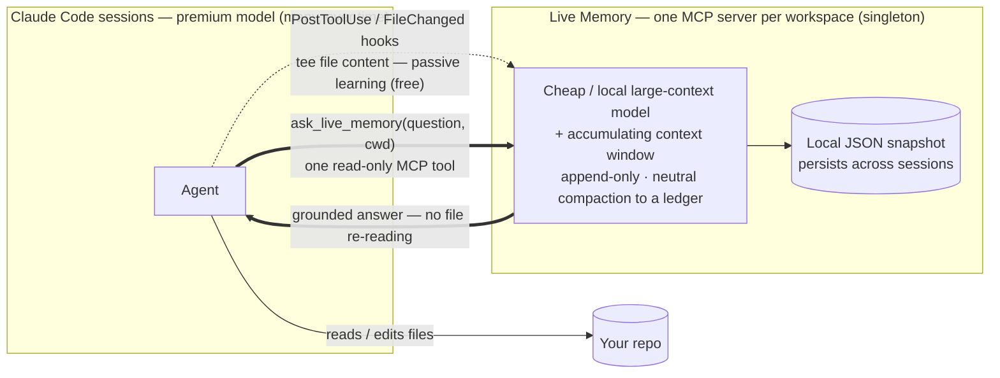

```
██╗     ██╗██╗   ██╗███████╗
██║     ██║██║   ██║██╔════╝
██║     ██║██║   ██║█████╗
██║     ██║╚██╗ ██╔╝██╔══╝
███████╗██║ ╚████╔╝ ███████╗
╚══════╝╚═╝  ╚═══╝  ╚══════╝
███╗   ███╗███████╗███╗   ███╗ ██████╗ ██████╗ ██╗   ██╗
████╗ ████║██╔════╝████╗ ████║██╔═══██╗██╔══██╗╚██╗ ██╔╝
██╔████╔██║█████╗  ██╔████╔██║██║   ██║██████╔╝ ╚████╔╝
██║╚██╔╝██║██╔══╝  ██║╚██╔╝██║██║   ██║██╔══██╗  ╚██╔╝
██║ ╚═╝ ██║███████╗██║ ╚═╝ ██║╚██████╔╝██║  ██║   ██║
╚═╝     ╚═╝╚══════╝╚═╝     ╚═╝ ╚═════╝ ╚═╝  ╚═╝   ╚═╝
        always-up-to-date codebase memory for Claude Code · ask, don't re-read
```

# Live Memory — Claude Code plugin

**A cheap, always-on model that learns your repo — so your agent stops re-reading it.**
Live Memory runs a separate, cheap large-context model as a long-lived MCP server that accumulates
knowledge of your codebase across sessions. Instead of re-reading the same files every session, your
agent asks one **read-only** tool, `ask_live_memory`, the broad-understanding questions — *"where is X,
how does Y work, what calls Z"* — and Live Memory answers in a way that **bootstraps the primary agent to
start doing productive work** (e.g., edits). It **learns passively** from your agent's own reads and edits
(teed via hooks — no extra reading) and stays current as the repo changes (modifications and deletions).
Read-only and path-jailed (it can never edit, create, or run anything); zero-config on a Claude
subscription (Haiku, no API key); the memory model is pluggable — point it at a local model or any
OpenAI-compatible endpoint.

## How it works



Your agent **reads or edits files as usual**; hooks quietly tee that content to the server so it **learns
for free**. When the agent needs to understand something, it **asks** `ask_live_memory` instead of
re-reading — the server answers from its accumulated, per-workspace memory (or reads the code itself,
read-only, if it hasn't seen it yet). One server serves every session and **persists across sessions**.

## Benchmarks

A/B on a real repo, **cost per task, run to completion**. Cost is shown three ways: the **premium
(building) model's bill** — what your *expensive* model spends, since the companion runs on a cheap or
local model — and **all-in**, also counting the companion's own cost on **DeepSeek-v4-flash** or **Haiku**:

| per task | premium-model bill | all-in · DeepSeek-flash† | all-in · Haiku | faster |
|---|---|---|---|---|
| **Understanding-heavy** (trace / comprehend) | **−61%** | **−57%** | **−25%** | **~22%** |
| **Hybrid** (understand-then-edit: bug fixes + features) | **−28%** | **−26%** | **−11%** | **~11%** |
| Pure edit / execution | ~break-even | ~break-even | ~break-even | ~0 |

Understanding-heavy work also offloads **~93%** of the premium model's codebase-reading tokens (with lower
cost variance), and correctness never regressed on the hybrid tasks (**12/12** passed with *and* without
it). DeepSeek-v4-flash **matched Haiku's answer accuracy** (98% vs 91% over 3 reps) at ~8× lower token
price; a **local** companion is ≈ free, so all-in ≈ the premium-model bill. Fully reproducible + audited
(human + Fable). Full numbers + methodology: [`benchmark/results/RESULTS.md`](./benchmark/results/RESULTS.md).

<sub>† companion re-priced at DeepSeek-v4-flash rates (~8× cheaper than Haiku); exact for the
understanding case, derived from the measured cost ratio for the hybrid case.</sub>

**Lineage:** Live Memory began as a feature of **[shofer.dev](https://shofer.dev)** (Arkware's
parallel multi-agent coding platform), where sessions share an in-sync codebase memory. This is that
idea as a **standalone Claude Code plugin** — a fresh implementation, self-contained, with no
dependency on shofer. Part of the **shofer** Claude Code plugin family (with
[slang-workflows](https://github.com/shofer-dev/claude-code-slang-orchestrator)).
Design: [`DESIGN.md`](./DESIGN.md) · Testing: [`TESTING.md`](./TESTING.md) · Privacy: [`PRIVACY.md`](./PRIVACY.md).

## Quickstart

live-memory is an **HTTP MCP server you run once** (a singleton that serves every Claude Code session)
plus a plugin that registers `ask_live_memory`, the hooks, and the slash commands. **Start the server
first** — Claude Code only *connects* to it (it never spawns it), so if it isn't running you'll get a
connection error.

**1 — Start the server** (zero-config on a Claude subscription → Haiku; no API key needed):

```bash
git clone https://github.com/shofer-dev/claude-code-live-memory
cd claude-code-live-memory/deploy && ./install-service.sh   # venv + user systemd service, auto-starts on boot
# …or just run it in a terminal:
#   cd claude-code-live-memory/server && pip install -e . && python -m live_memory
```

**2 — Install the plugin** (inside a Claude Code session):

```
/plugin marketplace add shofer-dev/claude-code-live-memory
/plugin install live-memory@shofer-live-memory
```

Ask your agent a whole-repo question — it'll call `ask_live_memory` instead of reading files.
`/live-memory-stats` shows accumulated knowledge + cost · `/live-memory-config` switches
model/provider · `/live-memory-empty` wipes memory. Providers, systemd, workspaces, and concurrency
are detailed below.

## Shape

```
live-memory/
├── .claude-plugin/plugin.json     # plugin manifest
├── .mcp.json                      # registers the server (type:http, explicit timeout)
├── hooks/                         # PostToolUse(Read|Write|Edit|…) + FileChanged → TEE file content (passive learning)
│   ├── hooks.json
│   └── notify.py
├── skills/live-memory/SKILL.md    # tells the agent when/why to call ask_live_memory
├── commands/                      # USER-facing slash commands (not agent tools)
│   ├── live-memory-stats.md       # /live-memory-stats  → GET /stats
│   ├── live-memory-config.md      # /live-memory-config → set model/provider, hot-reload
│   ├── live-memory-empty.md       # /live-memory-empty  → wipe memory (this workspace or `all`)
│   ├── stats.py · config.py · empty.py
├── settings.json
├── deploy/                        # systemd unit + env example + install-service.sh
└── server/                        # the long-running MCP server (Python, asyncio)
    ├── pyproject.toml             # deps + mypy(strict) + pytest config
    ├── tests/                     # pytest unit suite (mocked; no network)
    └── live_memory/
        ├── __main__.py            # entrypoint: python -m live_memory
        ├── server.py              # MCP (HTTP) ask_live_memory + /health + /stats + /notify + /reload
        ├── workspace.py           # per-cwd state registry (window + queue + store); fork/commit
        ├── manager.py             # the agent loop (process one question); compaction
        ├── context_window.py      # budget; file-context evict, Q&A summarize; fork/clone
        ├── summarizer.py          # NEUTRAL, query-agnostic knowledge-ledger summarization
        ├── question_queue.py      # per-workspace admission (serial/parallel) + per-entry timeout
        ├── async_jobs.py          # opt-in fire-and-forget job registry (submit/poll)
        ├── keep_warm.py           # background KV/prompt-cache keep-warm loop
        ├── conversation_store.py  # versioned JSON snapshot (SHA-256 file validation)
        ├── llm_client.py          # provider-pluggable: Anthropic Messages | OpenAI-compatible
        ├── oauth.py               # subscription OAuth credential + auto-refresh (zero-config)
        ├── config.py              # layered config (env > config.json > defaults) + provider knowledge
        ├── constants.py           # ALL tunable magic numbers + defaults, centralized (config sources its defaults here)
        ├── models.py              # core dataclasses (ChatMessage, FileContext, QuestionResult, …)
        ├── tool_executor.py       # read-only tools (Read/Grep/Glob/find_paths/git/…), path-jailed
        ├── directory_tree.py      # workspace scan, ~10% context cap
        ├── pricing.py             # per-model USD cost (+ env overrides)
        ├── logging_setup.py       # stderr→journald + optional rotating file
        └── prompts.py             # system prompt + neutral-summary prompt
```

## Architecture (see DESIGN.md for the full rationale)

- **One externally-supervised, idempotent HTTP MCP server** (singleton) serves all
  Claude Code sessions; state is keyed **per workspace** (`cwd`).
- **Model = independent + provider-pluggable**: the server runs its *own* cheap
  model (not the session's). Two adapters cover ~everything — **Anthropic Messages**
  (with `cache_control`) and **OpenAI-compatible** (DeepSeek/OpenAI/gateways).
  **Zero-config**: with no key but a Claude subscription, it uses the subscription
  OAuth token (auto-refreshed) on Haiku.
- **Passive (organic) learning**: PostToolUse/FileChanged hooks **tee the content**
  of the files your agent reads/edits into the memory, so it warms up for free from
  real work; `ask_live_memory` is the active fallback for anything unseen.
- **Append-only window between compactions**; compaction = **batched neutral
  summarization** with a high/low-watermark (rare, batched) — observed files + Q&A
  distilled into a query-agnostic knowledge ledger — never front-truncation.
- **Two-tier timeout**: `ask_live_memory(question, cwd, timeout)` — the soft
  `timeout` informs the model's budget and yields a best-effort answer before the
  hard `.mcp.json` MCP timeout.
- **Human status** via the `/live-memory-stats` slash command (→ `/stats`), kept
  off the agent's tool surface.

## Installation

**Prerequisites:** Python ≥ 3.10; **ripgrep** (`rg`) recommended (powers
`Grep`); `git` optional (powers `git_search` / `get_changed_files`).

**1. Install the server:**

```bash
cd server
pip install -e .          # runtime deps (mcp, anthropic, starlette, uvicorn, watchdog, httpx)
# for development/tests:  pip install -e ".[dev]"   # adds mypy, pytest, pytest-asyncio
```

**2. Install the plugin into Claude Code** so it reads `.mcp.json`, the hooks, the
skill, and the slash commands. The repo root doubles as a single-plugin
**marketplace** (`.claude-plugin/marketplace.json`); `/plugin install` only
installs *from a marketplace*, never a bare directory — so add the marketplace
first, then install from it. Inside a Claude Code session:

```
/plugin marketplace add https://github.com/shofer-dev/claude-code-live-memory
/plugin install live-memory@shofer-live-memory
```

`shofer` is the marketplace name; `live-memory` is the plugin name. To install
from a local clone instead, point `add` at the checkout directory:

```
/plugin marketplace add /ABSOLUTE/PATH/TO/claude-code-live-memory
/plugin install live-memory@shofer-live-memory
```

After editing plugin files later, run `/plugin marketplace update shofer` then
`/reload-plugins` (installed plugins are cached under `~/.claude/plugins/`, so
source edits aren't picked up live).

**For local development**, skip the marketplace entirely and launch Claude Code
with the plugin loaded directly — this *does* pick up edits via `/reload-plugins`:

```bash
claude --plugin-dir /ABSOLUTE/PATH/TO/claude-code-live-memory
```

(The server in step 3 must be running before Claude Code connects — `.mcp.json`
points at a `type:http` endpoint Claude Code only *connects* to, never spawns; if
the server is down you'll see a connection error in `/plugin`'s Errors tab.)

**3. Run the server** (next section). **4. Dev checks:** `mypy live_memory/ && pytest`.

## Running the server

The HTTP transport requires the server to be **already running** before Claude
Code connects (Claude Code does not start `type:http` servers) — run it under an
external supervisor (systemd/container/etc.).

**Zero-config** (no API key): if you're logged into a Claude subscription, it
just works — the server reuses that credential (auto-refreshed) on **Haiku**.

```bash
cd server && pip install -e .
python -m live_memory
# serves MCP at http://127.0.0.1:7711/mcp  (+ /health, /stats, /notify, /reload)
```

> The subscription path draws on your subscription's **rate-limit** budget (not
> $-metered) — a documented ToS gray area. For an always-on service prefer a key.

**Pick any model/provider** — env vars *or* the `/live-memory-config` slash
command (writes `config.json`, hot-reloads, no restart):

```bash
# DeepSeek (cheap, recommended), via env:
LIVE_MEMORY_PROVIDER=openai LIVE_MEMORY_BASE_URL=https://api.deepseek.com \
  LIVE_MEMORY_API_KEY=sk-... LIVE_MEMORY_MODEL=deepseek-chat  python -m live_memory

# …or at runtime, from inside Claude Code:
/live-memory-config set provider=openai base_url=https://api.deepseek.com model=deepseek-chat api_key=sk-...
/live-memory-config show
```

Supported providers: `anthropic` (Messages API + Bedrock/Vertex/gateways, API key
or subscription OAuth) and `openai` (any OpenAI-compatible endpoint: OpenAI,
DeepSeek, local models, gateways). Then enable the plugin so Claude Code reads
`.mcp.json` and connects.

## Run as a systemd service

`deploy/` has the boilerplate. One command registers and starts it:

```bash
cd deploy
./install-service.sh            # user service (recommended — see below)
./install-service.sh --system   # system-wide (best for API-key setups)
```

It creates a venv + installs the server, writes a config at
`~/.config/live-memory/live-memory.env` (from `live-memory.env.example` — edit it
for provider/model/key), installs `live-memory.service`, enables lingering, and
starts it. Config is supplied to the process by systemd via `EnvironmentFile=`.

- **Persistence survives restarts** automatically: per-workspace snapshots live
  in `LIVE_MEMORY_DATA_DIR` (default `~/.claude/plugins/data/live-memory`), so a
  restart reloads each workspace's memory on its next query.
- **Subscription (zero-config) auth needs a *user* service** (the default): it
  runs as you, so it can read `~/.claude/.credentials.json` and reuse your Claude
  login (auto-refreshed). A `--system` service can also do this, but the unit
  must set `User=` + `Environment=HOME=…` (the installer does this for you).

```bash
systemctl --user status live-memory
journalctl --user -u live-memory -f
systemctl --user restart live-memory     # after editing the env file
```

### Logs

By default the server logs to **stderr**, which systemd captures into the
**journal** — the idiomatic place, with rotation and unit/PID metadata:

```bash
journalctl --user -u live-memory -f          # user service
sudo journalctl -u live-memory -f            # system service
```

Two caveats and the escape hatch:
- A **user** service's journal only persists across reboots if journald has
  persistent storage (`/var/log/journal` exists). If yours is volatile, those
  logs vanish on reboot.
- For a durable, greppable plain-text log regardless, set
  `LIVE_MEMORY_LOG_FILE` (e.g. `/var/log/live-memory/live-memory.log` for a
  system service, or an absolute path under `~/.local/state/live-memory/` for a
  user one). It's a **rotating** handler (`LIVE_MEMORY_LOG_MAX_BYTES` ×
  `LIVE_MEMORY_LOG_BACKUPS`) and writes *in addition* to journald.
  `LIVE_MEMORY_LOG_LEVEL` (default `INFO`) tunes verbosity.

## Workspaces & `cwd`

Memory is keyed **per workspace**, from the `cwd` passed to `ask_live_memory`.
`cwd` must be an **absolute** path (a relative path is rejected — the shared
server can't resolve it against your session). By default the server snaps each
`cwd` to its enclosing **git repo root**, so a subdirectory and the repo root
share one memory:

| Env var | Default | Effect |
|---|---|---|
| `LIVE_MEMORY_CANONICALIZE_WORKSPACE` | `true` | Snap `cwd` to its git repo root. Set `false` for a distinct memory per exact directory. |
| `LIVE_MEMORY_REPO_ROOT_MODE` | `nearest` | Inside a submodule/worktree: `nearest` = the submodule's own root (git's default); `outermost` = the superproject root (fold submodule questions into the parent's memory). |

### Concurrency

Questions to the **same** workspace are admitted by one of two models:

| Env var | Default | Effect |
|---|---|---|
| `LIVE_MEMORY_CONCURRENCY` | `parallel` | `parallel` (default) = no queue delay — each question forks the window, up to `MAX_PARALLEL_QUERIES` run at once, and the fork that **explored the most codebase** commits back (others still return their answer but don't update shared memory). `serial` = one question at a time per workspace (shared window grows in place; strongest cache locality, concurrent callers wait). |
| `LIVE_MEMORY_MAX_PARALLEL_QUERIES` | `4` | Max concurrent questions per workspace in `parallel` mode. |

(Questions to *different* workspaces always run concurrently, regardless of this setting.)

### Async (fire-and-forget) tools — opt-in

MCP tool calls block the caller's turn until they return. If you want the agent
to submit a slow query, keep working, and collect the answer later, set
`LIVE_MEMORY_ASYNC_TOOLS=true` to additionally expose:

- `ask_live_memory_submit(question, cwd, timeout)` → returns a `job_id` immediately.
- `ask_live_memory_result(job_id)` → the answer when ready, or `[running]` to poll again.

The agent drives the polling (Claude Code can't push completion into a running
turn). Off by default; `ask_live_memory` (synchronous) is always available.

### Cache keep-warm

**Off by default** — opt in with `LIVE_MEMORY_KEEP_WARM=true`. A background loop
pings each recently-active workspace's prefix (`max_tokens=1`, output discarded)
so the provider's KV/prompt cache doesn't go cold between questions — keeping the
next real query on cache-hit pricing instead of a full cold re-read. The interval
is provider knowledge: ~240s for Anthropic/OpenAI (minute-scale caches), and
auto-set very long for **DeepSeek** (its disk cache lasts hours/days, so even
enabled it self-disables there). Override with `LIVE_MEMORY_KEEP_WARM_INTERVAL_S`,
or stop warming idle workspaces sooner with `LIVE_MEMORY_KEEP_WARM_MAX_IDLE_S`.
`/live-memory-stats` shows when the cache was last refreshed.
